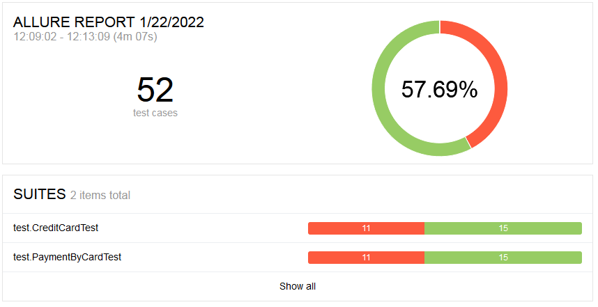

# Отчётные документы по итогам тестирования

### Краткое описание

В соответствии с планом работ были написаны и выполнены авто-тесты для веб-сервиса "Путешествие дня". 
Авто-тесты включали в себя позитивные и негативные проверки приобретения тура (оплата по карте и покупка в кредит):

* Покупка с одобренной картой;
* Покупка с отклоненной картой;
* Покупка с пустым полем;
* Покупка с неверным форматом заполнения поля;
* Покупка с истёкшим сроком карты.

### Количество тест-кейсов

* Общее количество тест-кейсов - 52;
* Успешные - 30;
* Не успешные - 22.

#### Отчет Allure

Процентр положительных тестов

Процентр отрицательных тестов

Тесты покупка в кредит

Тесты оплата по карте

#### Общие рекомендации

* Исправить ошибку одобрения покупки по карте или покупки в кредит при использовании отклоненной карты;
* Исправить некорректное поведение системы - при покупке в кредит происходит запись в таблицу "order_entity" как оплата по карте;
* Исправить поведение системы при некорректном вводе поля CVC/CVV (появляется подсказка у поля Владелец);
* Ввести проверку истечения срока действия карты по месяцу;
* Ввести проверку на ввод нулей в поле Месяц;
* Ввести проверку допустимых символов для поля Владелец;
* Ввести проверку граничных значений для поля Владелец и добавить соответствующую подсказку;
* Добавить подсказку обязательного поля при пустом заполнении полей Номер карты, Месяц, Год и CVC/CVV.
